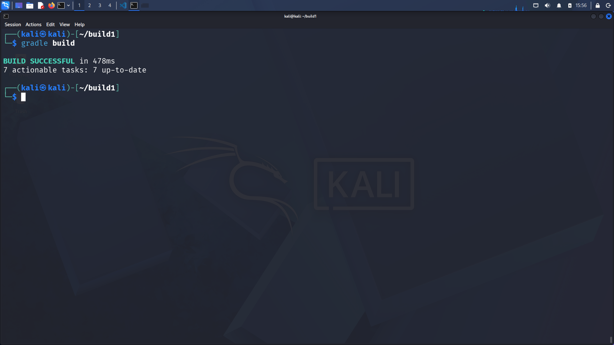

# Lab 1 - Building and Packaging Java Applications with Gradle

## 📌 Overview
This lab demonstrates how to build, test, and package a Java application using Gradle.

---

## ⚙️ Step 1: Install Gradle
Install Java and Gradle:

    sudo apt update
    sudo apt install -y openjdk-17-jdk gradle

---

## 📥 Step 2: Clone Repository

    git clone https://github.com/Ibrahim-Adel15/build1.git
    cd build1

---

## 🧪 Step 3: Run Tests

    gradle test

---

## 🏗️ Step 4: Build App

    gradle build

---

## 🚀 Step 5: Run App

    java -jar build/libs/ivolve-app.jar

---

## ✅ Result
- Tests pass
- Build succeeds
- App runs successfully
