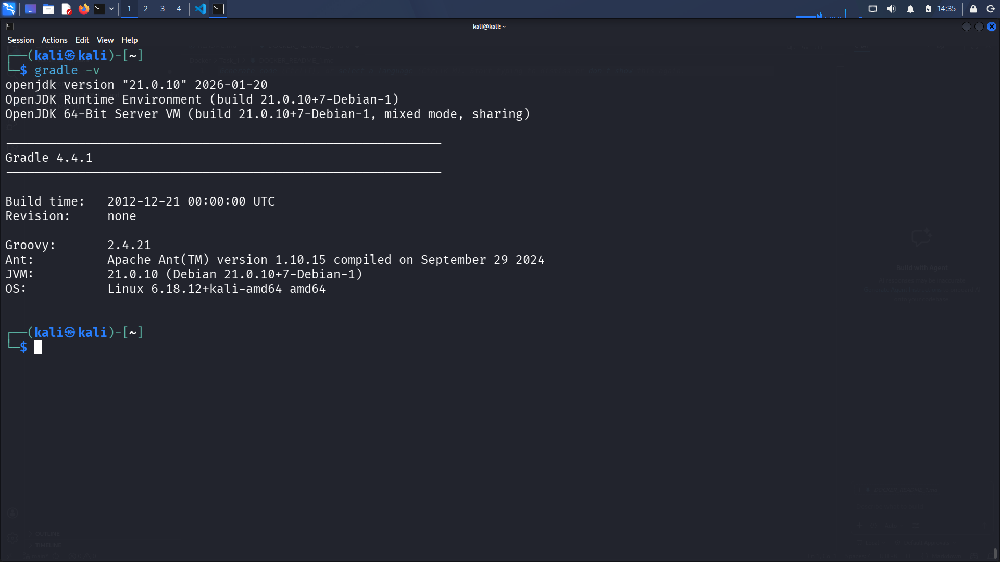
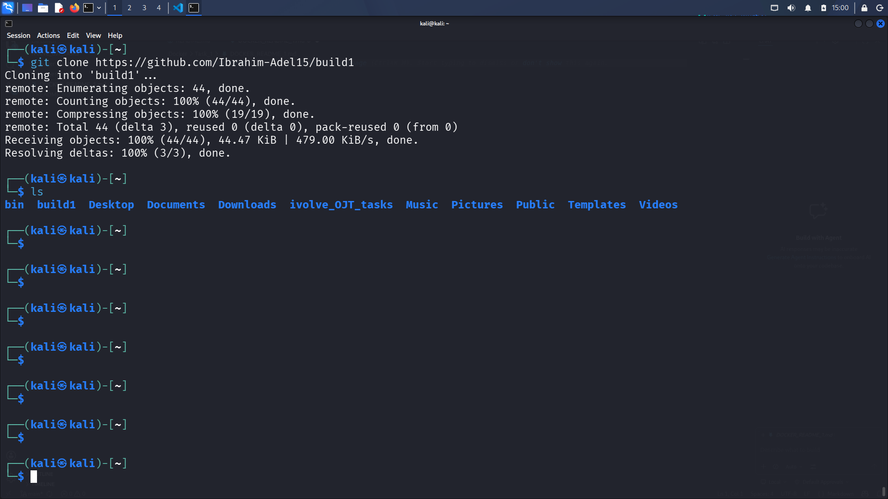
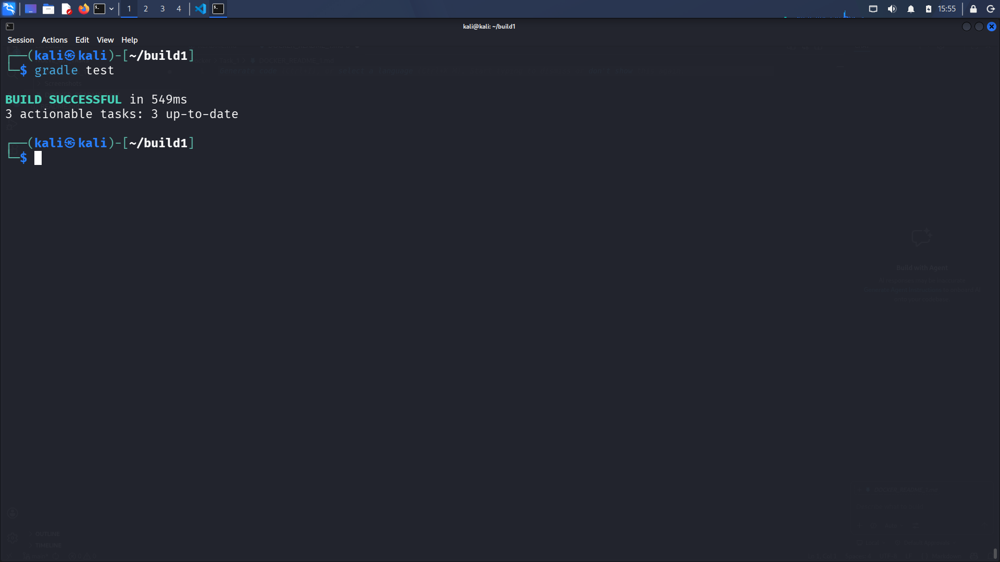
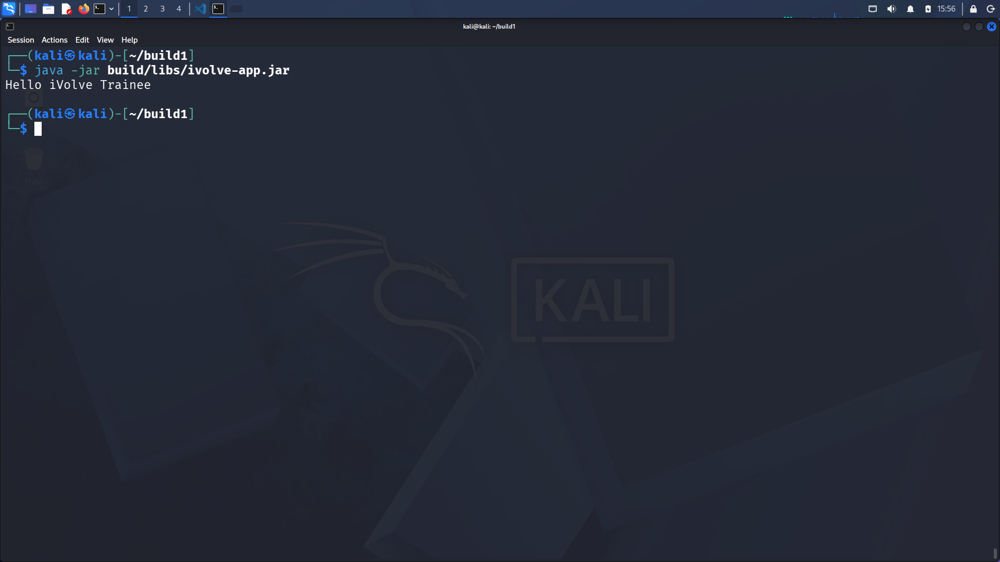

cat << 'EOF' > README.md
# Lab 1: Building and Packaging Java Applications with Gradle

## Objective
Build, test, and package a Java application using Gradle on Kali Linux.

---

## Prerequisites
- Kali Linux  
- Java 17 installed  
- Gradle installed  
- Git  
- VS Code (recommended)

---

## Step-by-Step Instructions

### 1. Install Gradle and Java
~~~sh
sudo apt update
sudo apt install -y openjdk-17-jdk gradle
~~~

---

### 2. Clone the Application Code
~~~sh
git clone https://github.com/Ibrahim-Adel15/build1.git
cd build1
~~~

---

### 3. Run Unit Tests
~~~sh
gradle test
~~~

---

### 4. Build the Application
~~~sh
gradle build
~~~

---

### 5. Run the Application
~~~sh
java -jar build/libs/ivolve-app.jar
~~~

---

## Commands Summary

| Step | Command | Description |
|------|--------|------------|
| 1 | sudo apt install openjdk-17-jdk gradle | Install dependencies |
| 2 | git clone ... | Clone repository |
| 3 | gradle test | Run unit tests |
| 4 | gradle build | Build the application |
| 5 | java -jar build/libs/ivolve-app.jar | Run the app |

---

## ✅ Lab Completed Successfully

- Gradle installed successfully  
- Repository cloned  
- Unit tests executed successfully  
- Application built successfully  
- Application ran successfully  

📁 Screenshots are available in the `Screenshots/` folder.

---
