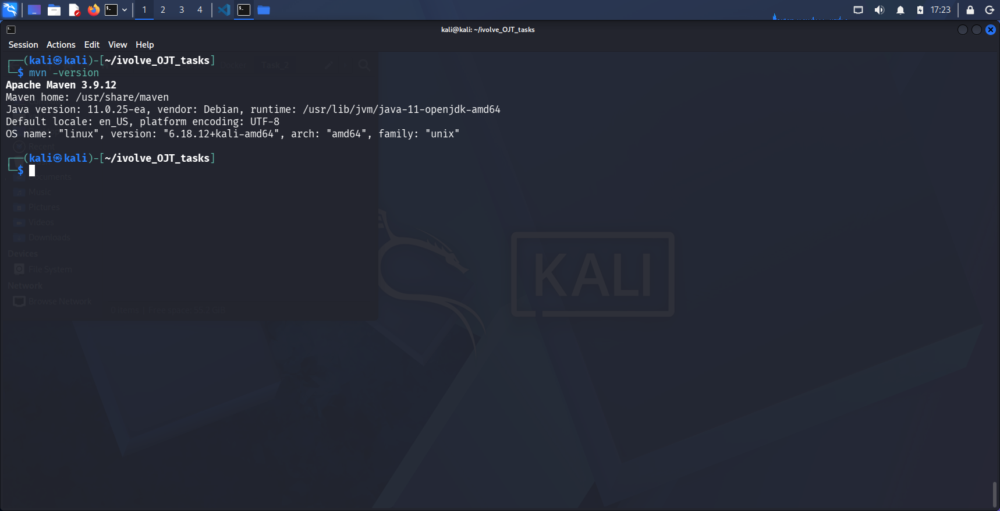
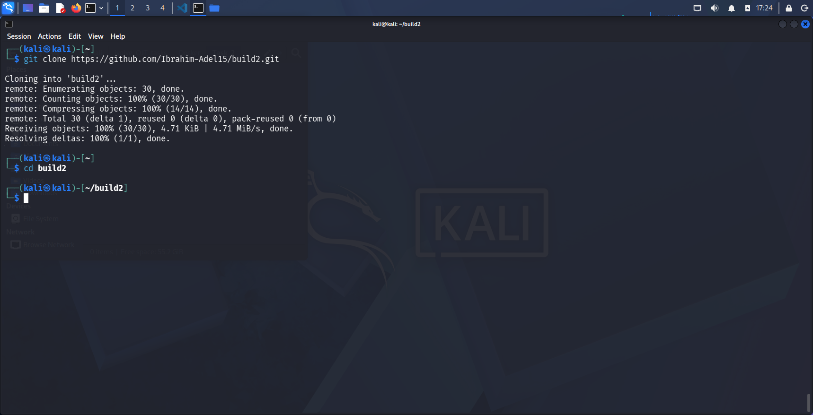
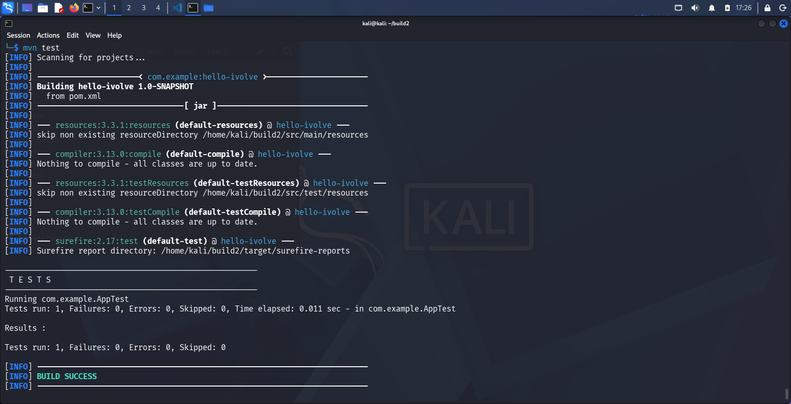
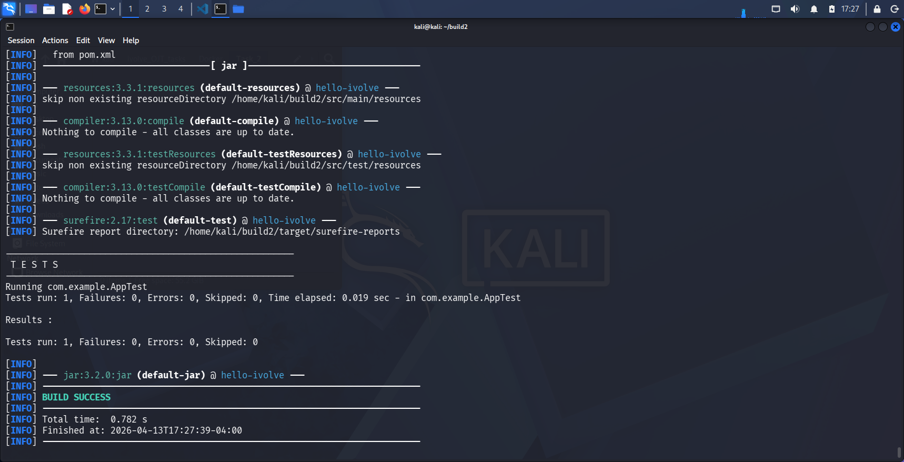
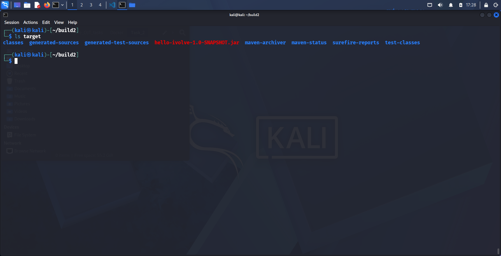
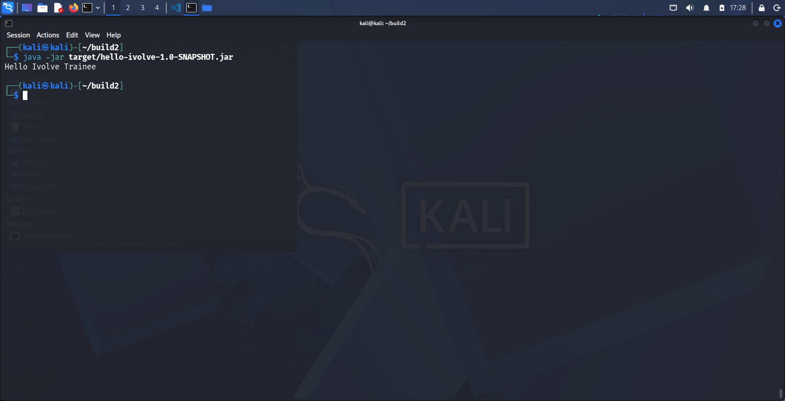

# Lab 2: Building and Packaging Java Applications with Maven

## Objective
Build, test, and package a Java application using Maven on Kali Linux.

---

## Prerequisites
- Kali Linux  
- Java 17 installed  
- Maven installed  
- Git  
- VS Code (recommended)

---

## Step-by-Step Instructions

### 1. Install Maven and Java
~~~sh
sudo apt update
sudo apt install -y openjdk-17-jdk maven
~~~

---

### 2. Clone Repository
~~~sh
git clone https://github.com/Ibrahim-Adel15/build2.git
cd build2
~~~

---

### 3. Run Unit Tests
~~~sh
mvn test
~~~

---

### 4. Build Application
~~~sh
mvn package
~~~

---

### 5. Run Application
~~~sh
java -jar target/hello-ivolve-1.0-SNAPSHOT.jar
~~~

---

## Commands Summary

| Step | Command | Description |
|------|--------|------------|
| 1 | sudo apt install openjdk-17-jdk maven | Install dependencies |
| 2 | git clone ... | Clone repository |
| 3 | mvn test | Run unit tests |
| 4 | mvn package | Build JAR |
| 5 | java -jar target/...jar | Run application |

---

## ✅ Lab Completed Successfully

- Maven installed successfully  
- Repository cloned  
- Tests passed successfully  
- Application built successfully  
- JAR generated in `target/`  
- Application runs successfully  

📁 Screenshots are in the `Screenshots/` folder.
