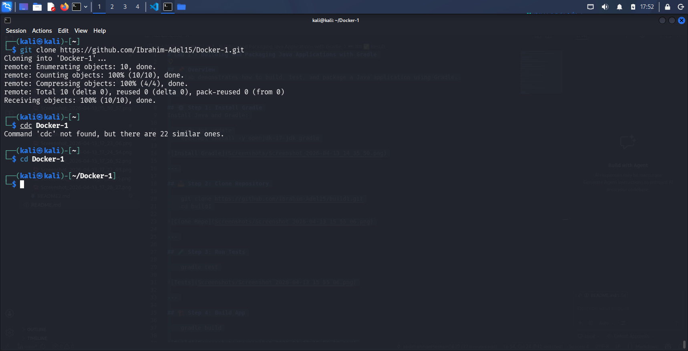
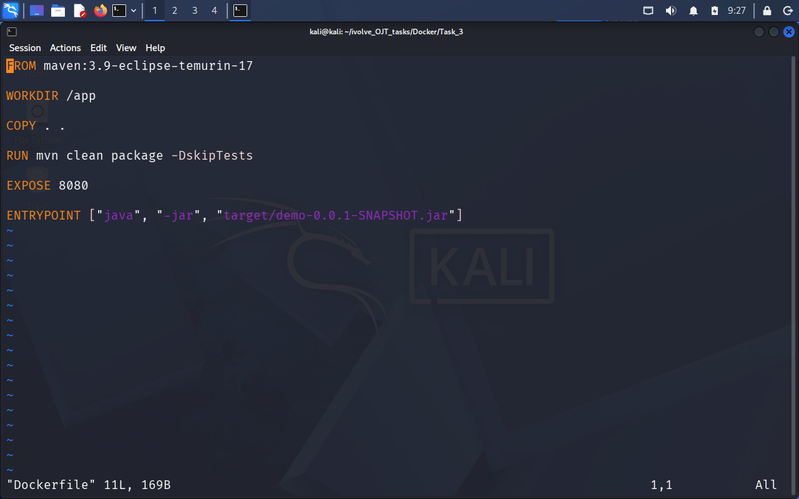
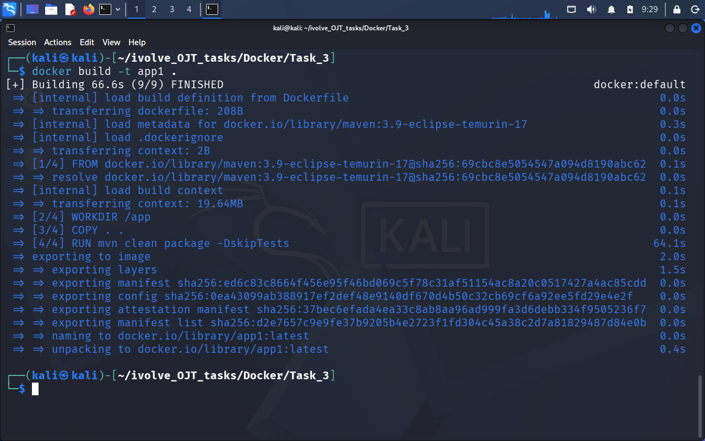
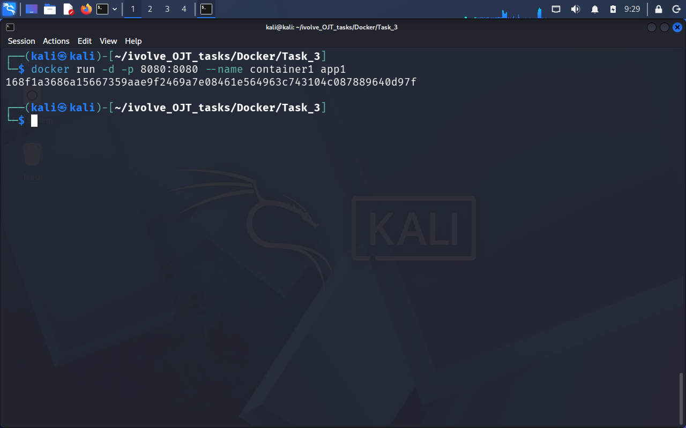
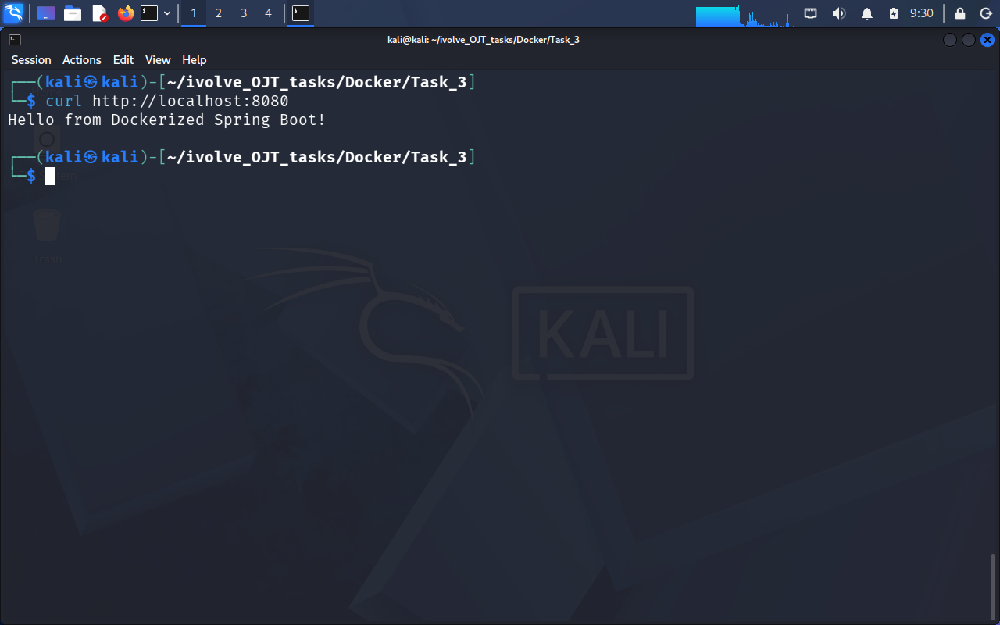
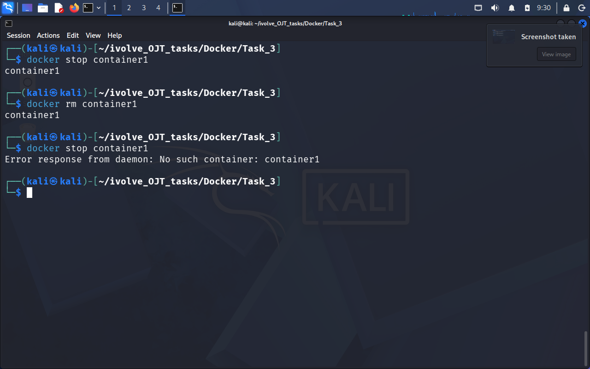

# Lab 3: Run Java Spring Boot App in a Container

## Objective
Containerize a Spring Boot Java application using Docker on Kali Linux.

---

## Prerequisites
- Kali Linux  
- Docker installed and running  
- Git  
- VS Code (recommended)

---

## Step-by-Step Instructions

### 1. Clone the Application Code
~~~sh
git clone https://github.com/Ibrahim-Adel15/Docker-1.git
cd Docker-1
~~~

---

### 2. Create the Dockerfile
Create a file named `Dockerfile` in the root directory:

~~~sh dockerfile
FROM maven:3.9-eclipse-temurin-17
WORKDIR /app
COPY . .
RUN mvn clean package -DskipTests
EXPOSE 8080
ENTRYPOINT ["java", "-jar", "target/demo-0.0.1-SNAPSHOT.jar"]
~~~

---

### 3. Build the Docker Image
~~~sh
docker build -t app1 .
~~~

---

### 4. Run the Container
~~~sh
docker run -d -p 8080:8080 --name container1 app1
~~~

---

### 5. Test the Application

using curl:
~~~sh
curl http://localhost:8080
~~~

---

### 6. Stop and Remove the Container
~~~sh
docker stop container1
docker rm container1
~~~

---

## Commands Summary

| Step | Command | Description |
|------|--------|------------|
| 1 | git clone ... | Clone the project |
| 3 | docker build -t app1 . | Build Docker image |
| 4 | docker run -d -p 8080:8080 --name container1 app1 | Run container |
| 5 | curl http://localhost:8080 | Test app |
| 6 | docker stop container1 && docker rm container1 | Stop & remove |

---

## ✅ Lab Completed Successfully

- Application containerized using Docker  
- Image built successfully  
- Container running on port 8080  
- Application tested successfully  

📁 Screenshots are in the `Screenshots/` folder.

---

